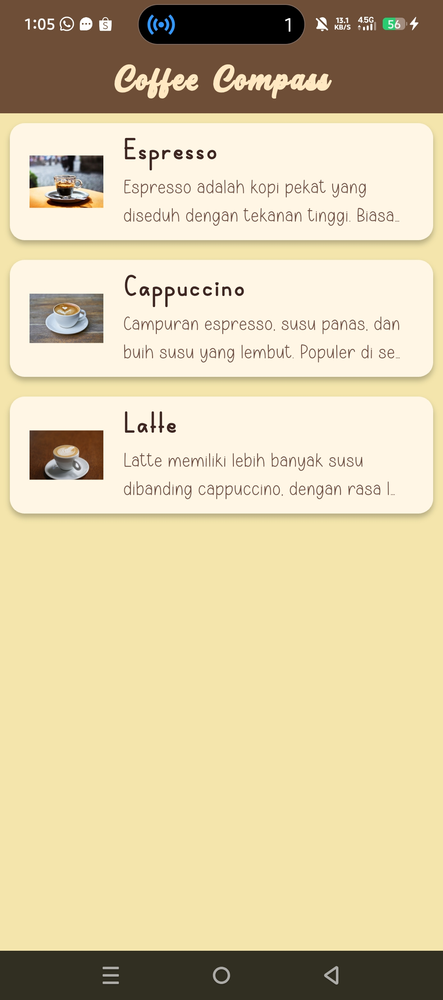
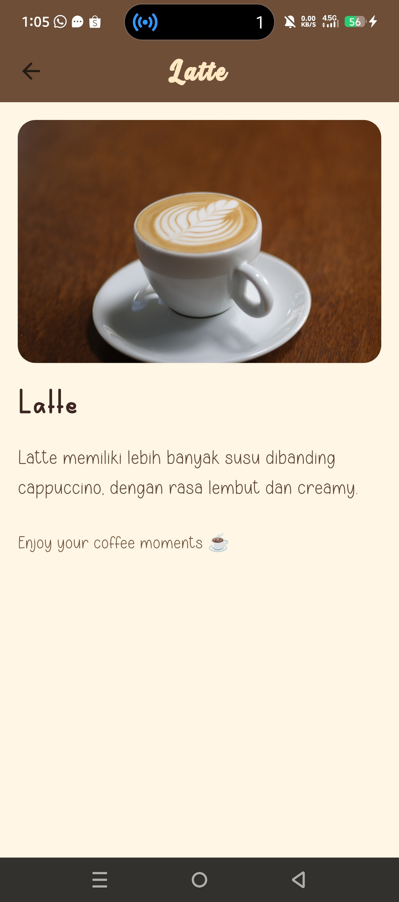

<h1 align="center">☕ Coffee Compass</h1>

  <em>Latihan Flutter themed app.</em>

---

  
  

  <i>Tampilan antarmuka aplikasi Coffee Compass</i>

---

## 🚀 Fitur Utama
- 🔍 Pencarian kopi berdasarkan lokasi  
- ❤️ Simpan kopi favorit  
- 🪶 Desain minimalis dan responsif  
- ☁️ Data dinamis dari sumber online  

---

## 🛠️ Teknologi
| Platform | Bahasa | Framework |
|-----------|---------|------------|
| Android/iOS | Dart | Flutter |

---

  <b>Made by <a href="https://github.com/afrizal8">afrizal8</a></b>

